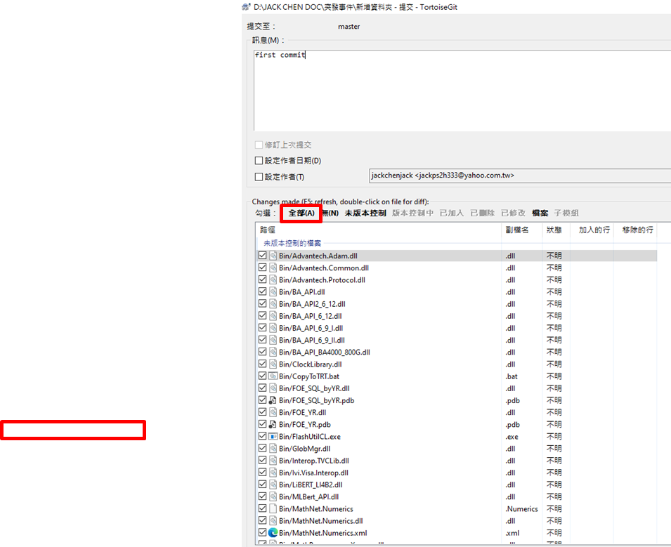
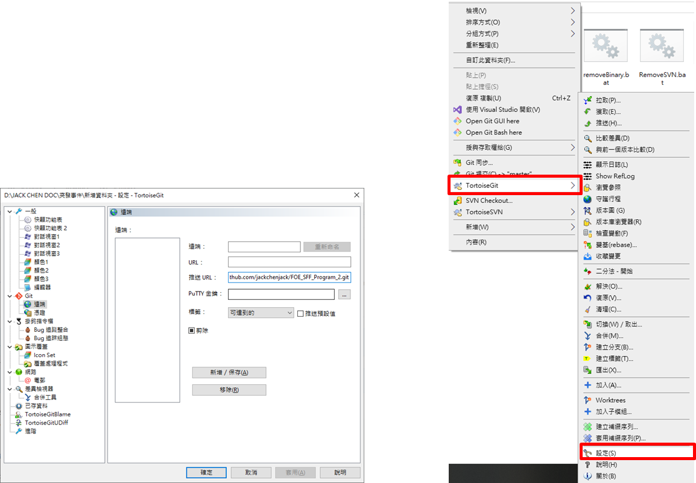
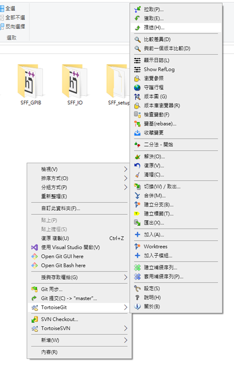
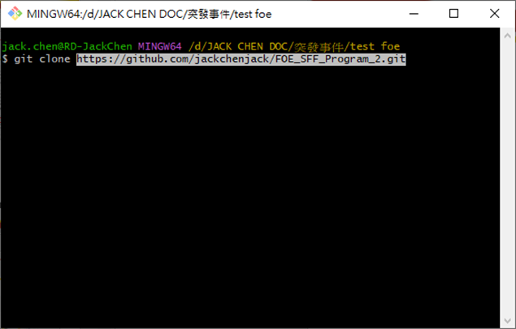

# 所需程式
1. Git Bash
2. TortoiseGit

步驟如下
1. Git bash
2. Git init (Command方式)
3. Copy data
4. 右鍵 commit 至本地端
5. Web Create repository資料庫
6. 設定 複製web 網址 至git 遠端 貼上 
7. 推送 

以上步驟 是Git commit方式

Git clone 右圖為 將檔案下載的方式

小結
步驟結合 CMD 以及小烏龜 交替使用 

To Do List
Gitingore使用方式 (待學習)
